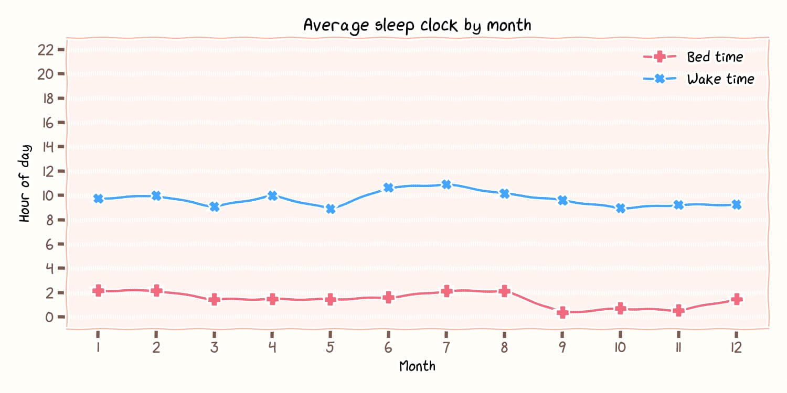
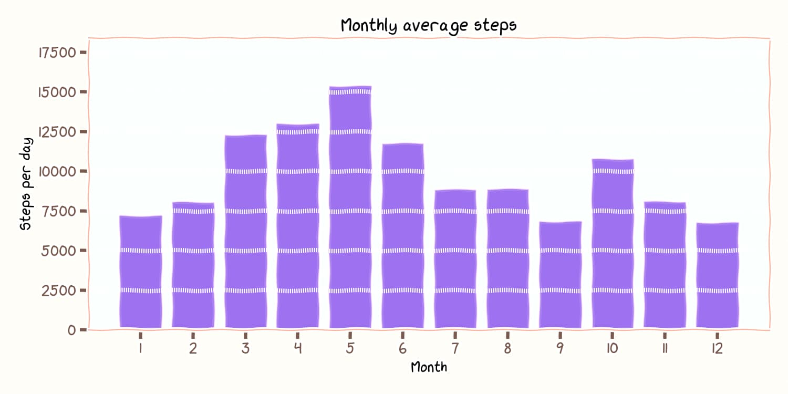

# Mi Fitness Yearly Visualization

A Python tool for visualizing personal fitness data exported from Mi Fitness. Generate insightful charts about your sleep patterns, steps, and activity trends with xkcd-style plots.

可视化从小米运动健康导出数据的 Python 工具，使用 xkcd 风格生成有关睡眠模式、步数和活动趋势的图表。

## Features

- 📊 **Sleep Analysis**: Bedtime/waketime trends by month and weekday
- 🚶 **Steps Tracking**: Monthly averages and weekday patterns  
- 🛌 **Sleep Stages**: Detailed breakdown of sleep cycles (Deep, REM, Light, Awake)
- 🎨 **xkcd Style**: Hand-drawn aesthetic visualizations
- 📁 **Multiple Formats**: Export as PNG, SVG
- ⚙️ **Customizable**: Adjust time range, timezone, and fonts

## Example Visualizations

 

 

## Installation

### Requirements

```bash
pip install matplotlib pandas numpy
```

### Font Setup (Optional)

For the authentic xkcd style, install the [xkcd font](https://github.com/ipython/xkcd-font).

## Usage

### 1. Export Your Data
First, export your fitness data from Xiaomi Health:
1. Visit <https://account.xiaomi.com/fe/service/account/privacy>
2. Request a data export (select Mi Fitness data)
3. Wait for email notification (typically a few hours)
4. Download and extract the zip file
5. Locate `hlth_center_aggregated_fitness_data.csv`

### 2. Generate Visualizations

```bash
# Basic usage with default settings
python main.py path/to/hlth_center_aggregated_fitness_data.csv

# Custom output directory and format
python main.py data.csv --output-dir my_plots --format svg

# Change timezone (default: UTC+8)
python main.py data.csv --timezone -5  # UTC-5

# Use different font
python main.py data.csv --font "Comic Neue"
```

## Data Privacy

**Important**: This tool runs entirely locally on your computer. Your fitness data never leaves your machine. The script only reads the exported CSV file and generates visualizations locally.

## Acknowledgments

Special thanks to [NanoApe](https://github.com/Konano) for the inspiration. This tool was developed with the assistance of LLMs including GitHub Copilot, Claude, ChatGPT, and DeepSeek.
